<div align="center">
  
</div>

<div align="center">

[](https://credittrack.elitex.cc)
[](https://credittrack.elitex.cc)
[](https://credittrack.elitex.cc)

</div>

---

## What is CreditTrack?

CreditTrack is a **Singapore-focused credit card bill tracker and miles optimisation tool** built for members of the EliteX.CC miles community. It eliminates manual data entry by using Google Gemini AI to extract transaction data directly from uploaded bank statements (PDFs or photos), then applies crowdsourced miles strategy to help you earn more on every dollar spent.

> Built for Singapore power cardholders — DBS, UOB, Citibank, HSBC, OCBC, Standard Chartered, and AMEX.

---

## Key Features

| Feature | Description |
|---|---|
| **AI Bill Extraction** | Drop a PDF or photo (or snap one with your phone camera). Gemini AI reads every transaction, amount, and due date — including consolidated multi-card DBS/Citi statements |
| **Crowdsourced Miles Strategy** | AI-powered card recommendations shaped by Singapore's miles community. Know exactly which card to use for dining, travel, online shopping, and more |
| **Smart Payment Reminders** | Trigger-based emails via Resend, scheduled exactly 3 days before each due date. Auto-cancelled when you mark a bill as paid |
| **Full Portfolio Analytics** | Spend trends by bank, category breakdowns, risk scoring, and total outstanding — all in one dashboard |
| **Mobile-First Design** | Bottom navigation, swipeable bill cards, bottom-sheet modals, and a quick-action FAB built for on-the-go use |
| **Multi-Device Sync** | AI insights cached in Supabase — analysis runs once and syncs across all your devices |

---

## How It Works

```
1. Upload   →  Drop a PDF/image or snap with your phone camera
2. Extract  →  Gemini AI parses every transaction and due date automatically
3. Optimise →  Get miles strategy advice and automated reminders — zero setup
```

---

## Tech Stack

| Layer | Technology |
|---|---|
| Frontend | React 18 + TypeScript + Vite + Tailwind CSS |
| Backend | Express 5 (serverless via Vercel) |
| Database | Supabase (PostgreSQL + Auth + Storage + RLS) |
| AI | Google Gemini 2.5 Flash |
| Email | Resend (trigger-based scheduling + cancellation) |
| Hosting | Vercel (Hobby — 1 cron job for weekly summaries) |

---

## Architecture

```
Browser (React SPA)
    │
    ├── Supabase JS SDK  →  Supabase (DB / Auth / Storage)
    └── /api/*           →  Express (Vercel Serverless)
                                ├── Gemini API  (AI extraction & insights)
                                └── Resend API  (scheduled email reminders)
```

- All Resend calls are **server-side only** — no email API keys in the browser
- Supabase **Row Level Security** ensures users can only access their own data
- AI insights are cached per-user in Supabase (`ai_insights` table) — Gemini is called only when bills change, not on every page load

---

## Environment Variables

Copy `.env.example` to `.env` and fill in your own values:

```bash
# Supabase — the VITE_ and non-VITE_ variables are the SAME credentials, declared twice.
# Vite only exposes variables prefixed with VITE_ to the browser (via import.meta.env).
# Express reads variables without the prefix via process.env.
# On Vercel, set both names to the same value in your project settings.
VITE_SUPABASE_URL=        # e.g. https://xxxx.supabase.co
VITE_SUPABASE_ANON_KEY=   # your Supabase anon/public key
SUPABASE_URL=             # same value as VITE_SUPABASE_URL
SUPABASE_ANON_KEY=        # same value as VITE_SUPABASE_ANON_KEY

# Gemini AI (server-side only — keep this secret)
VITE_GEMINI_API_KEY=

# Resend email (server-side only)
RESEND_API_KEY=
EMAIL_FROM=

# Cron job protection
CRON_SECRET=
```

---

## Running Locally

```bash
npm install
npm run dev     # Vite dev server (frontend + HMR)
npm start       # Express server (backend, email reminders)
```

---

## Supabase Schema

Core tables: `profiles`, `bills`, `transactions`, `system_config`, `email_logs`, `ai_insights`

Storage bucket: `bill-documents` (signed URLs, 1-hour expiry)

---

## Cron Jobs (Vercel)

One active cron on the Vercel Hobby plan:

| Schedule | Endpoint | Action |
|---|---|---|
| Every Monday 9 AM SGT | `/api/trigger-weekly` | Weekly financial summary email to all users |

Payment reminders are **trigger-based** (not cron) — scheduled via Resend `scheduledAt` at upload time, automatically cancelled on payment.

---

## Security

- No secrets in source code — all credentials loaded from environment variables
- Supabase anon key scoped by Row Level Security policies
- Cron endpoints protected by `CRON_SECRET` bearer token
- `migrated_prompt_history/` excluded from git

---

<div align="center">

Built by **EliteX.CC Group** · Singapore · 2026

[Live App](https://credittrack.elitex.cc) · [Report Issue](https://github.com/jeratomise/CreditTrackSG/issues)

</div>
